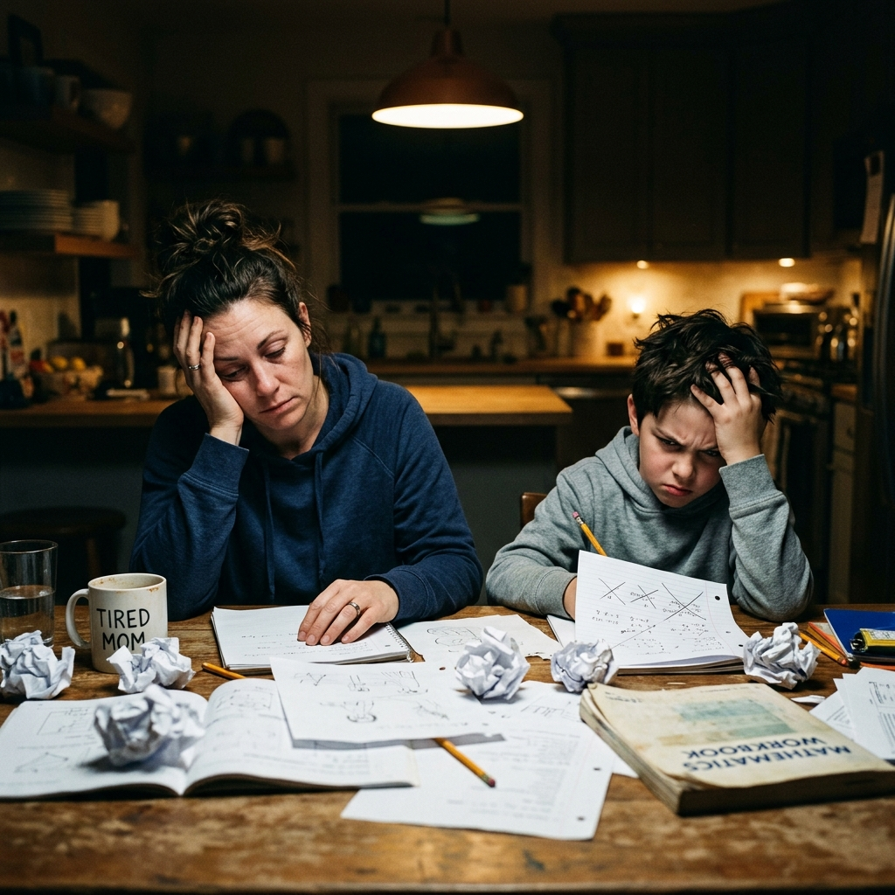
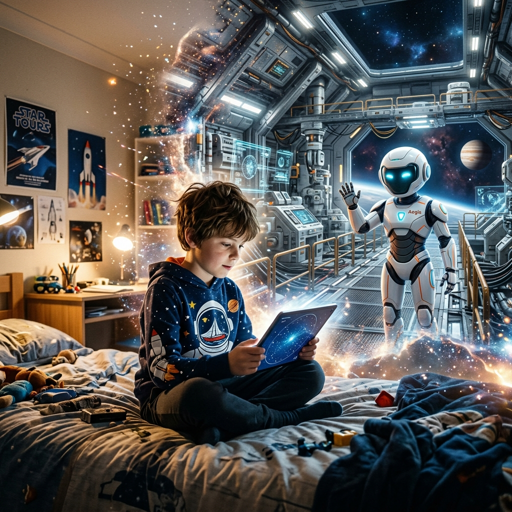
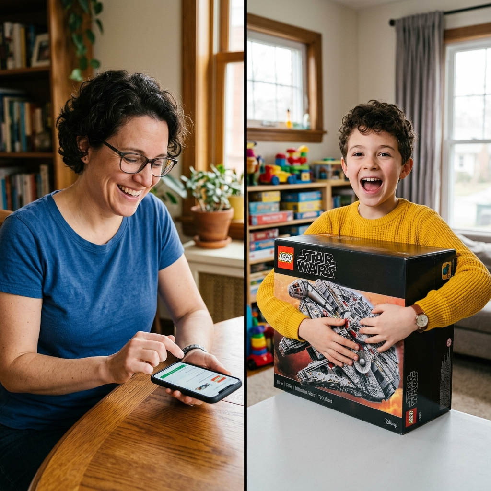
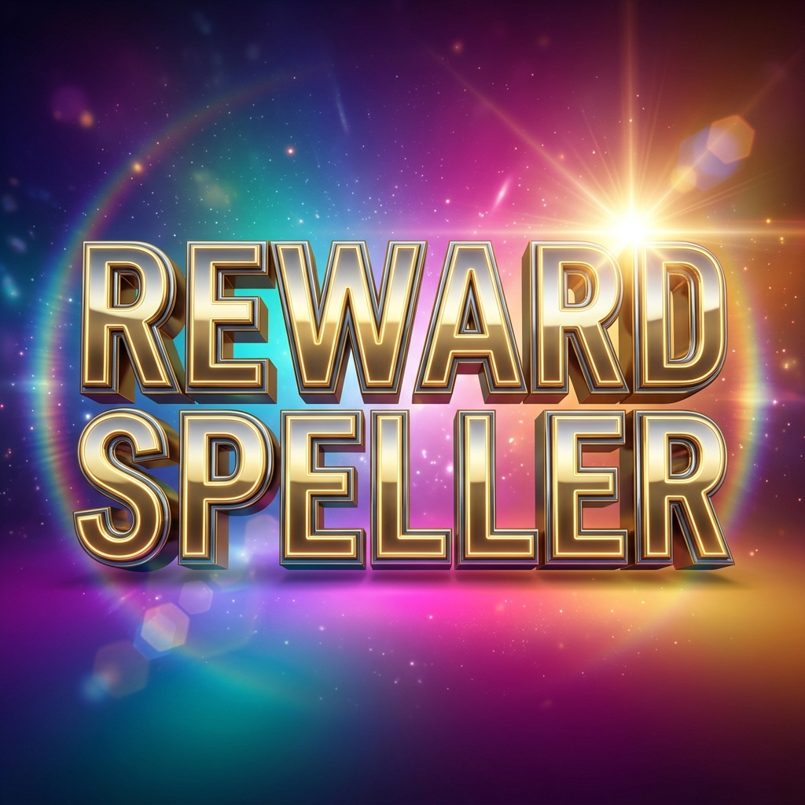

# 🎬 Master Production Script: RewardSpeller Commercial

**Project**: RewardSpeller Brand Anthem  
**Target Duration**: 45 Seconds  
**Aspect Ratio**: 16:9 (Widescreen Cinematic)  
**Workflow**: Nano Banana (Start/End Frame Interpolation) $\rightarrow$ Veo Video Generation $\rightarrow$ Gemini TTS (SSML Emotion Cadence)

---

## 🎙️ The Voiceover Script (SSML Blueprint)

*To be synthesized via Gemini TTS / Google Cloud TTS using the exact emotional cadence markers below:*

```xml
<speak>
  <voice emotion="weary" rate="slow">
    Spelling practice. Historically, a leading cause of premature graying in parents. <break time="400ms"/>
  </voice>
  
  <voice emotion="hopeful" rate="medium">
    But what if it didn't have to be a hostage negotiation? <break time="300ms"/>
  </voice>
  
  <voice emotion="excited" intensity="high" rate="fast">
    Enter <emphasis level="strong">Reward Speller</emphasis>! <break time="300ms"/>
  </voice>
  
  <voice emotion="enthusiastic" rate="medium">
    We replaced the dreary kitchen table with exceptional, immersive theming. <break time="200ms"/> 
    We swapped out that 1990s robotic dictation for ultra-realistic Text-To-Speech— 
  </voice>
  
  <voice emotion="sarcastic" pitch="low">
    because 'c-a-t' shouldn't sound like a dial-up modem. <break time="300ms"/>
  </voice>
  
  <voice emotion="excited" intensity="medium">
    Gamification keeps them engaged, and parent-sponsored rewards mean you finally have <break time="100ms"/> <emphasis level="moderate">leverage</emphasis>. <break time="400ms"/>
  </voice>
  
  <voice emotion="relieved" rate="slow">
    They learn, they earn, and you get to finish your coffee while it's still actually hot. <break time="500ms"/>
  </voice>
  
  <voice emotion="confident" intensity="high" pitch="high">
    <emphasis level="strong">Reward Speller</emphasis>. <break time="200ms"/> 
    Upgrade your spelling strategy today.
  </voice>
</speak>
```

---

## 🎞️ Scene-by-Scene Director's Guide & Storyboard

### 🚨 System Directives for Generation
1. **Character Consistency Lock**:
   - **The Child**: Must always be described as *"a 10-year-old child with short curly brown hair wearing a bright yellow sweater."*
   - **The Parent**: Must always be described as *"a parent with glasses and short black hair wearing a blue button-down shirt."*
2. **Aesthetic**: High-fidelity cinematic photography, rich vibrant colors, and dynamic lighting contrasting the dreary "before" and glowing "after" of using the platform.

---

### Scene 1: The Hook (0 - 5 Seconds)
**Voiceover Match**: *"Spelling practice. Historically, a leading cause of premature graying in parents. But what if it didn't have to be a hostage negotiation? Enter Reward Speller!"*

| Start Frame (Nano Banana) | End Frame (Nano Banana) |
| :---: | :---: |
|  | *A sleek tablet displaying a glowing, colorful educational app sits in the center of the kitchen table. Both parent and child are smiling, illuminated by warm inviting lighting.* |

* **Start Frame Prompt**: A parent with glasses and short black hair wearing a blue button-down shirt, and a 10-year-old child with short curly brown hair wearing a bright yellow sweater, sitting at a kitchen table covered in crumpled paper. The child looks frustrated, the parent looks tired. Dim, dramatic lighting, cinematic photography.
* **End Frame Prompt**: The same kitchen table with the same parent and child. The crumpled paper is gone. A sleek tablet displaying a glowing, colorful educational app sits in the center. Both are smiling, illuminated by warm and inviting lighting.
* **Veo Transition Prompt**: Morph smoothly from the dim lighting to bright warm lighting. Fast-motion sweep to clear the crumpled papers off the table, revealing the glowing tablet.

---

### Scene 2: Exceptional Theming (5 - 15 Seconds)
**Voiceover Match**: *"We replaced the dreary kitchen table with exceptional, immersive theming."*

| Start Frame (Nano Banana) | End Frame (Nano Banana) |
| :---: | :---: |
| *The 10-year-old child with short curly brown hair wearing a bright yellow sweater, holding a tablet in a standard, slightly messy bedroom with neutral lighting.* |  |

* **Start Frame Prompt**: The 10-year-old child with short curly brown hair wearing a bright yellow sweater, holding a tablet in a standard, slightly messy bedroom with neutral lighting.
* **End Frame Prompt**: The same child holding a tablet, but the bedroom walls have entirely dissolved into a highly detailed, vibrant sci-fi space station with a friendly white-armored robot character in the background. Cinematic lighting.
* **Veo Transition Prompt**: Dynamically expand and morph the standard bedroom walls into a sci-fi space station. Keep the child perfectly still and focused on the tablet while the background transforms around them.

---

### Scene 3: Realistic TTS (15 - 25 Seconds)
**Voiceover Match**: *"We swapped out that 1990s robotic dictation for ultra-realistic Text-To-Speech—because 'c-a-t' shouldn't sound like a dial-up modem."*

| Start Frame (Nano Banana) | End Frame (Nano Banana) |
| :---: | :---: |
| *Extreme close-up of a tablet screen showing a static, neutral-faced 3D animated digital guide character.* | *Extreme close-up of the same tablet screen. The 3D animated digital guide character is now smiling warmly, with a vibrant multi-colored sound wave glowing at the bottom of the screen.* |

* **Start Frame Prompt**: Extreme close-up of a tablet screen showing a static, neutral-faced 3D animated digital guide character.
* **End Frame Prompt**: Extreme close-up of the same tablet screen. The 3D animated digital guide character is now smiling warmly, with a vibrant, multi-colored sound wave glowing at the bottom of the screen.
* **Veo Transition Prompt**: Smoothly animate the digital guide character from a neutral expression to a natural smile. Ripple the glowing sound wave at the bottom of the screen smoothly in perfect sync with an audio beat.

---

### Scene 4: Gamification (25 - 35 Seconds)
**Voiceover Match**: *"Gamification keeps them engaged..."*

| Start Frame (Nano Banana) | End Frame (Nano Banana) |
| :---: | :---: |
| *Close up of the 10-year-old child with short curly brown hair wearing a bright yellow sweater, looking intensely at a tablet screen. Anticipation on their face, illuminated by the screen's glow.* |  |

* **Start Frame Prompt**: Close up of the 10-year-old child with short curly brown hair wearing a bright yellow sweater, looking intensely at a tablet screen. Anticipation on their face, illuminated by the screen's glow.
* **End Frame Prompt**: Close up of the same child smiling widely and triumphantly, heavily illuminated by glowing digital golden coins and confetti radiating outward from the tablet screen.
* **Veo Transition Prompt**: Explode glowing digital confetti and golden coins outward from the tablet screen in a smooth slow-motion effect, dynamically lighting up the child's smiling face as they cheer.

---

### Scene 5: Parent Sponsored Rewards (35 - 42 Seconds)
**Voiceover Match**: *"...and parent-sponsored rewards mean you finally have leverage. They learn, they earn, and you get to finish your coffee while it's still actually hot."*

| Start Frame (Nano Banana) | End Frame (Nano Banana) |
| :---: | :---: |
| *A vertical split-screen composition. Left side: the parent at a sleek office desk looking at a smartphone. Right side: the child looking expectantly at their tablet.* |  |

* **Start Frame Prompt**: A vertical split-screen composition. Left side: the parent with glasses and short black hair wearing a blue button-down shirt at a sleek office desk looking at a smartphone. Right side: the child in the yellow sweater looking expectantly at their tablet.
* **End Frame Prompt**: A vertical split-screen composition. Left side: the parent smiling and tapping the smartphone screen. Right side: the child cheering enthusiastically while holding a large, brand-new toy building block set.
* **Veo Transition Prompt**: The parent on the left taps their phone, sending a bright glowing digital spark across the split-screen line that instantly materializes the large toy box directly into the child's hands on the right.

---

### Scene 6: The Outro (42 - 45 Seconds)
**Voiceover Match**: *"Reward Speller. Upgrade your spelling strategy today."*

| Start Frame (Nano Banana) | End Frame (Nano Banana) |
| :---: | :---: |
| *The text 'Reward Speller' written in clean, flat 2D white typography centered on a solid vibrant blue background.* |  |

* **Start Frame Prompt**: The text "Reward Speller" written in clean, flat 2D white typography centered on a solid, vibrant blue background.
* **End Frame Prompt**: The text "Reward Speller" rendered in bold, premium 3D typography with a cinematic lens flare, resting on a vibrant, multi-colored gradient background.
* **Veo Transition Prompt**: Smoothly extrude the flat text into 3D typography while rotating it slightly on its axis. Sweep a bright cinematic lens flare across the letters from left to right.

---

## 🛠️ Production Execution Notes

### 1. Video Interpolation (Veo Studio)
- Load each Start and End frame pair into Veo.
- Apply the exact Veo Transition Prompts to guide the generative AI's motion vectors.
- Ensure the 16:9 aspect ratio is locked across all exports.

### 2. Audio Compositing (Gemini Studio)
- Process the SSML script through Gemini TTS.
- Overlay a subtle, upbeat cinematic background music track (ducking the volume by -12dB during voiceover segments).
- Sync the digital guide's sound wave animation in Scene 3 to the primary vocal frequencies of the TTS audio file.
